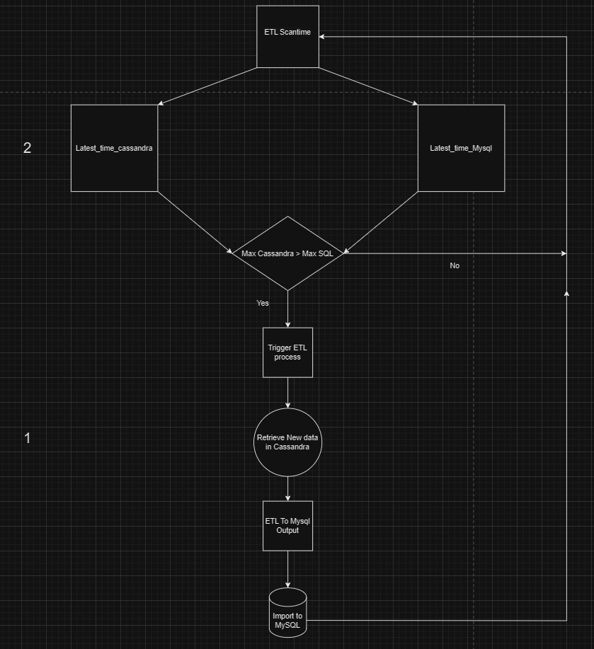
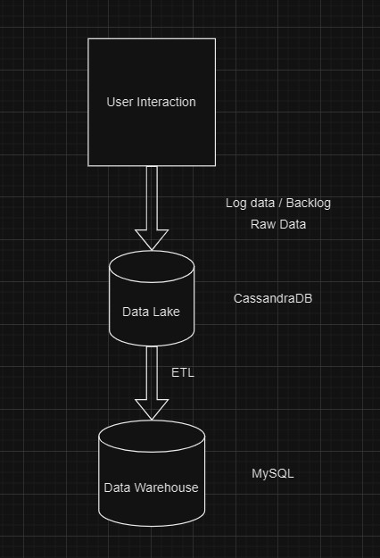
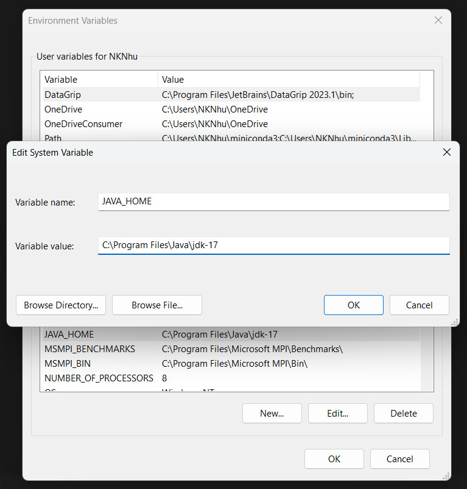
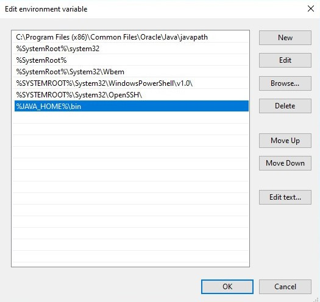
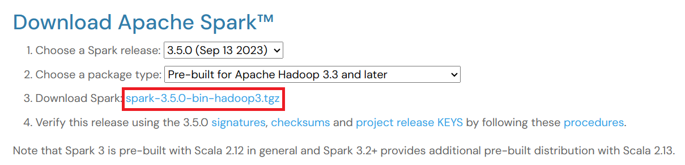
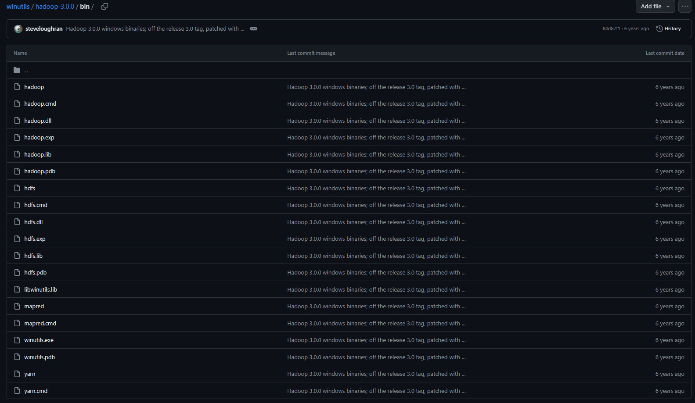
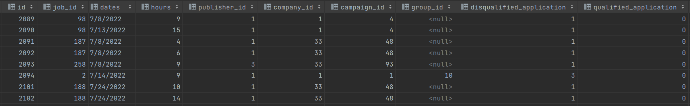
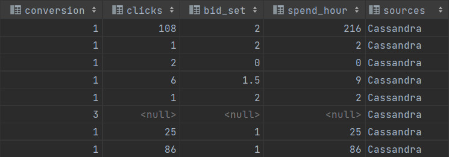
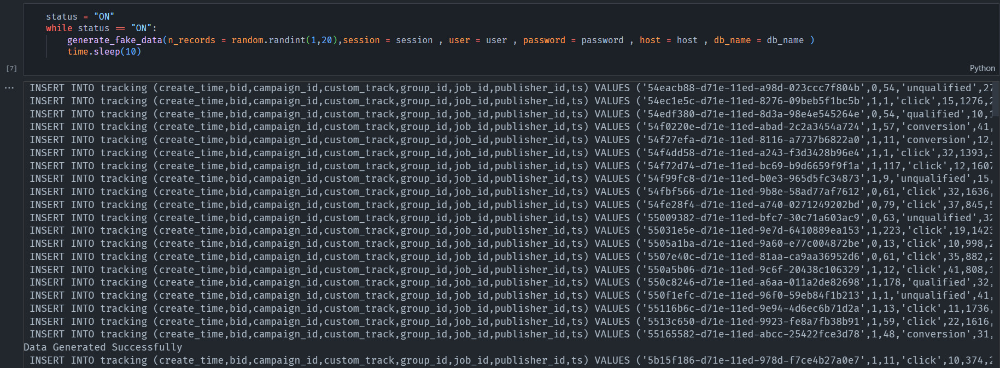
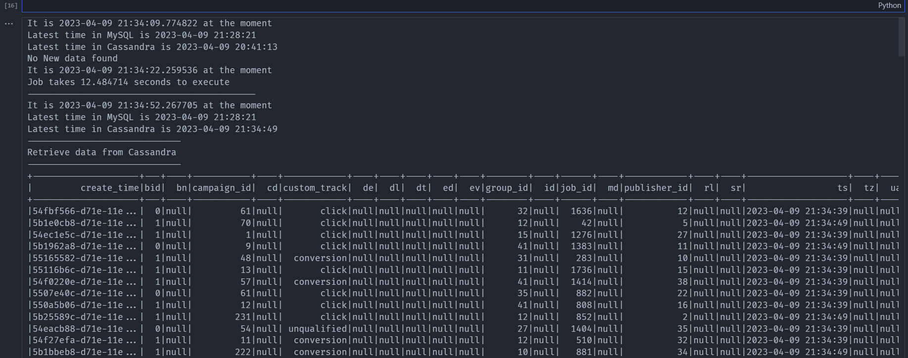

# **ETL Recruiting Platform**
<h5> CDC (change data capture) into the streaming ETL process</h5>

  <div>
     &nbsp  &nbsp  &nbsp  &nbsp  &nbsp 
  </div>

## **1. Introduction**
  - The Near Real-Time Recruitment Platform is a dynamic application designed for seamless user interaction, generating log data (raw data) as users engage with the platform. All user-generated data is stored in a data lake, ensuring a comprehensive record of user activities.
  
  - To maintain data accuracy and relevance, the server periodically compares the data lake and data warehouse, triggering an automated ETL (Extract, Transform, Load) process. If new data is detected in the data lake, it is promptly updated in MySQL, ensuring that the database reflects the most recent user interactions.

  <p align="center">
    
    <center>
      <figcaption>
        <b>Stage 1:</b><i> ETL Data </i>
        <br>
        <b>Stage 2:</b><i> Check if there is new data in the data lake?</i>
      </figcaption>
    </center>
  </p>

  <p align="center">
    
    <center>
      <figcaption>
        <b>Stage 1:</b><i> ETL Data</i>
        <br>
        <i>In this project, I use Cassandra as data lake, and MySQL as data Warehouse.</i>
      </figcaption>
    </center>
  </p>
  
## **2. Installation and Setup Environment Variables**
- **PYTHON**
  
  If your device already has Python, skip this step, otherwise download it [here](https://docs.conda.io/projects/miniconda/en/latest/).

- **JAVA**
  
  - To confirm that Java's installed on your machine,  just open cmd and type java -version. You should be able to see the version of Java installed on your system. Otherwise, download [here](https://www.oracle.com/java/technologies/downloads/#jdk18-windows).
  
  - After finishing the installation with default settings. Now, open the system environment variables dialogue.
  
  - Click the **Environment Variables...** button.
  
  - Click the **New…** button in the System Variables section.
  
  - Then, type **JAVA_HOME** in the **Variable name** field and provide your **JDK installation path** in the **Variable value** field. 
  	  
    It should look like:
  <p align="center">
    
  </p>

  - Now click **OK**.
  - Then, click the **Path** variable in the **System Variable** section under the Environment Variables dialogue box you just opened.
  - Edit the path and click the **New** button and add **“%JAVA_HOME%\bin”** at the end of it.
   
    It should look like:
  <p align="center">
    
  </p>

- **SPARK**
  
  - Download [Apache Spark](https://spark.apache.org/downloads.html).
  <p align="center">
    
  </p>

  - Download that file, then create a **Spark** folder, extract the downloaded file into that folder.

  - Then go back to **system environment variable** to create **SPARK_HOME** and add the **"%SPARK_HOME%\bin"** to **Path** variable in the **System Variables** section under the Environment Variables dialogue box you just opened. **Same with JAVA installation.**

- **HADOOP**  

  - Create another folder named **Hadoop** → then go to this github [link](https://github.com/steveloughran/winutils) → select hadoop 3.0 → go to bin → download the winutils.exe file and place it in the **Hadoop** folder.
  <p align="center">
    
  </p>

  - Go back to **system environment variable** to create **HADOOP_HOME** and add the **"%HADOOP_HOME%\bin"** to **Path** variable in the **System Variables** section under the Environment Variables dialogue box you just opened.

## **3. Extract, Transform, Load (ETL)**
### **ETL process: using Pyspark, MySQL Server, Cassandra, and Docker**

\- **Convert UUID to datetime:** In time tracking logs, the uuid format is used. For easier analysis, the uuid should be converted to a normal datetime format.
```python
  def process_timeuuid(df):
    uuidtime_list = []
    datetime_list = []
    create_time_list = df.select('create_time').collect()
    for i in range(len(create_time_list)):
        uuidtime_list.append(create_time_list[i][0])
        date_time = time_uuid.TimeUUID(bytes=UUID(create_time_list[i][0]).bytes).get_datetime().strftime("%Y-%m-%d %H:%M:%S")
        datetime_list.append(date_time)
    time_data = spark.createDataFrame(zip(uuidtime_list, datetime_list), ['create_time', 'ts'])
    result = df.drop(df.ts).join(time_data, 'create_time', 'inner')
    result = result.select('create_time','ts','job_id','custom_track','bid','campaign_id','group_id','publisher_id')
    return result
```
\- Calculate the total number of clicks, number of candidates, and number of qualified and unqualified candidates for jobs running on the website.

  <p align="center">
    
    
    <center>
      <figcaption>
        <i>This is the result that will be obtained after completing the ETL process.</i>
      </figcaption>
    </center>
  </p>

## **4. Data Streaming with CDC (Change Data Capture)**
**What is Streaming ETL ?**
>\- **Streaming ETL**, which stands for extract, transform, and load, is a data integration process that involves obtaining data from many sources, changing it to fit the requirements of the target system, and using it in near real-time.<br><br>
>\- In contrast to traditional batch ETL, which involves periodic and scheduled data extraction and transformation, streaming ETL retrieves and modifies data as soon as it's received. <br><br>
>\- By combining log-based CDC (change data capture) into the streaming ETL process, the final system is always up to date with the most current data from the source system. This allows for real-time analytics and well-informed decision-making.

**What is CDC ?**
>\- **Change Data Capture (CDC)** is a technique used in data integration processes that identifies and captures changes made to data in a database or data source. It captures and tracks changes in near real-time updates to the target system for up-to-date data access. <br><br>
>\- **CDC works** by creating a separate log that contains information about the changes made to the data, including the type of change, the time of the change, and the affected data. The log is then used to update the target system with the changed data, enabling real-time data integration.


```python
  while True:
    host = 'localhost'
    port = '3306'
    db_name = 'SDE_DataWarehouse'
    user = 'root'
    password = '1'
    url = 'jdbc:mysql://' + host + ':' + port + '/' + db_name
    driver = "com.mysql.cj.jdbc.Driver"

    timestart = datetime.datetime.now()
    print("It is {} at the moment".format(timestart))

    mysql_time = retrieve_latest_time_mysql(url,driver,user,password)
    print('Latest time in MySQL is {}'.format(mysql_time))
    
    cassandra_time = retrieve_cassandra_latest_time()
    print('Latest time in Cassandra is {}'.format(cassandra_time))
    
    if cassandra_time > mysql_time :
        main_task(mysql_time)
    else :
        print('No New data found')
    timeend = datetime.datetime.now()
    print("It is {} at the moment".format(timeend))
    print("Job takes {} seconds to execute".format((timeend - timestart).total_seconds()))
    print("-------------------------------------------")
    time.sleep(30)
```

## **5. Simulate**

To simulate running CDC (change data capture) into the streaming ETL process, I generated dummy data to better understand how the process works.

**Generate Fake Data**
  <p align="center">
    
    <center>
      <figcaption>
        <i>Dummy data is inserted to the data lake continuously.</i>
      </figcaption>
    </center>
  </p>

**Result**
  <p align="center">
    
  </p>

## License
[MIT](https://choosealicense.com/licenses/mit/)